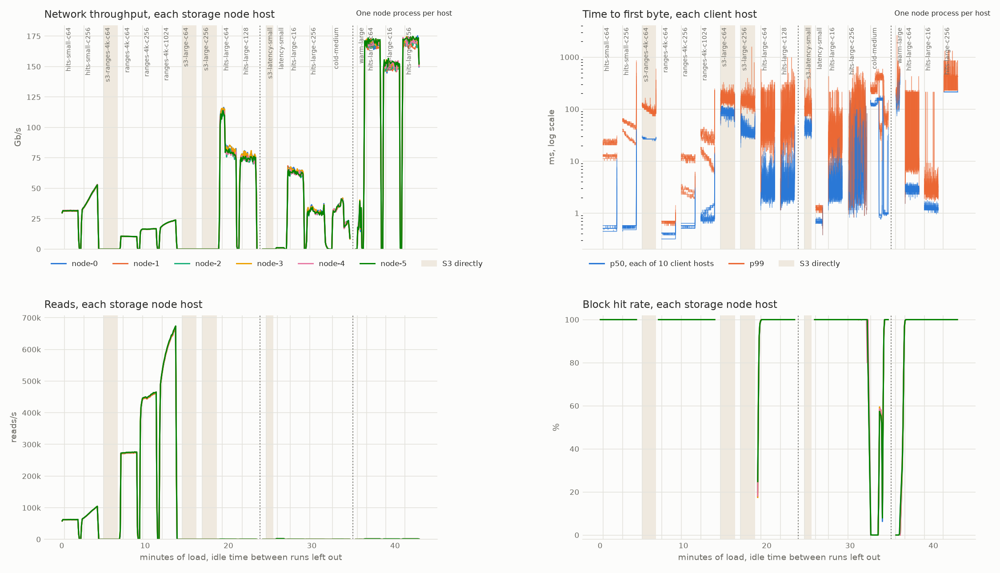
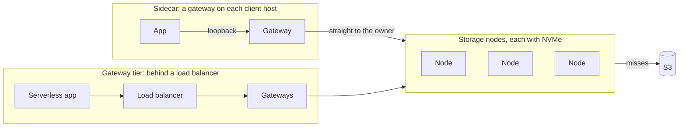
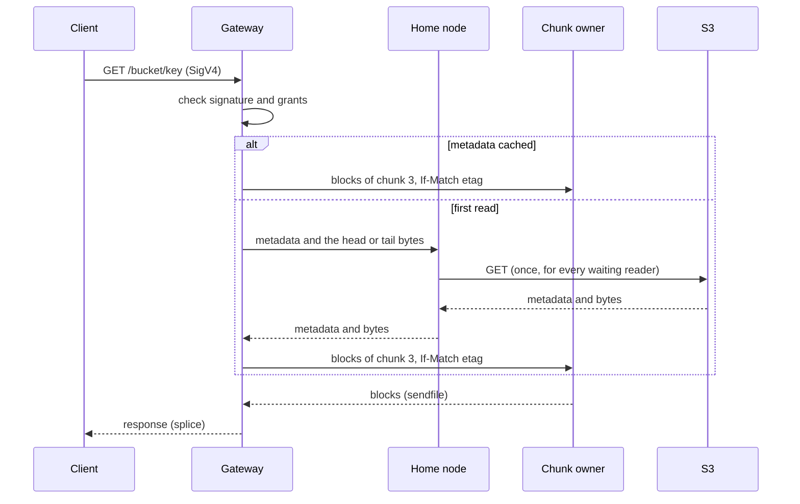
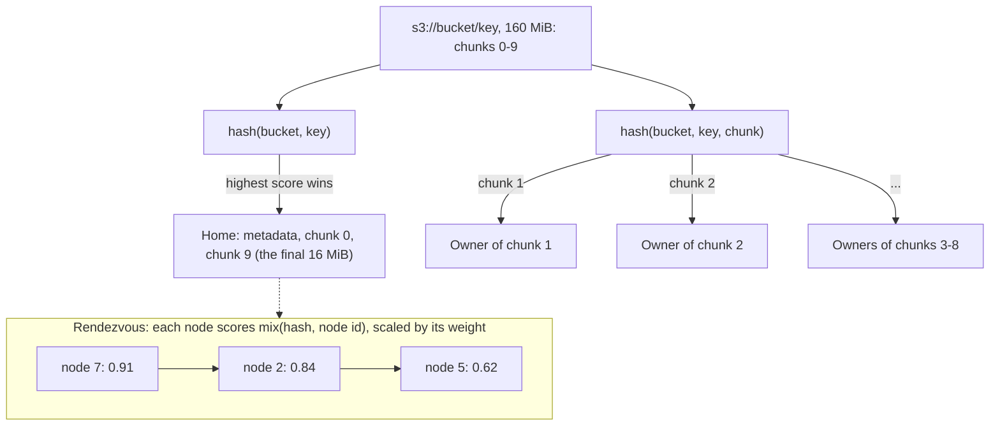
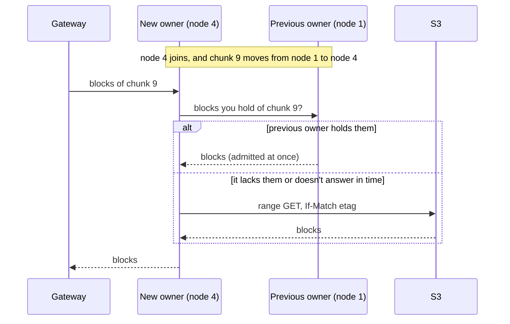
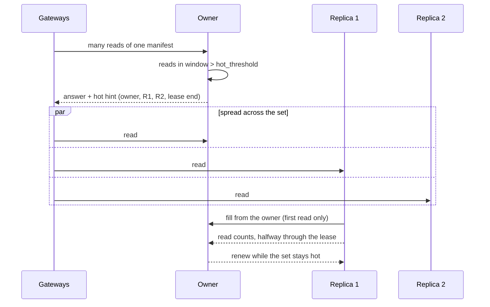
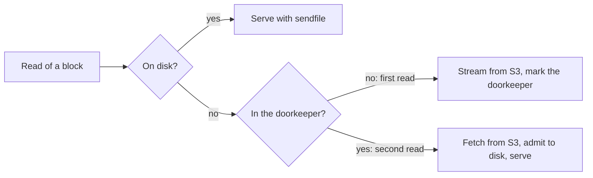

# s3-accelerator

A distributed NVMe read cache in front of S3. Clients keep their S3 SDKs and point them at the cache; S3 stays the source of truth, and the cache holds only copies it can drop. A hit's first byte arrives in well under a millisecond, the cluster serves as much bandwidth as its network cards carry, and every byte served from the cache is an S3 GET saved.

[spec.md](spec.md) is the design contract, [BENCHMARKS.md](BENCHMARKS.md) records every measurement, and [PLAN.md](PLAN.md) tracks the build.

## Contents

- [The scale test](#the-scale-test)
- [What sets it apart](#what-sets-it-apart)
- [Quick start](#quick-start)
- [Deployment modes](#deployment-modes)
- [How it works](#how-it-works)
  - [Partitioning](#partitioning)
  - [Ring changes](#ring-changes)
  - [Hot-key replication](#hot-key-replication)
  - [Admission on the second read](#admission-on-the-second-read)
  - [Consistency](#consistency)
- [Operator guide](#operator-guide)
  - [Tuning](#tuning)
- [Development](#development)



*Two tests with the current defaults, each over its measured 100 seconds, on six storage hosts running 32 node processes each. Top: 256 MiB objects at 64 connections per client host. Every node sends about 170 Gb/s, its share of the clients' 1 Tb/s, with first byte near 3 ms at p50. Bottom: 4 KiB ranges at 64 connections per client host: 1.84 million reads a second, first byte 0.34 ms at p50 and 0.59 ms at p99. Each line is one storage node host, except in the latency panels, where each pair is one client host.*

## The scale test

Ten c8in.16xlarge client hosts (64 vCPUs, 100 Gb/s each) read one dataset from S3 directly and through six m8idn.32xlarge storage hosts (128 vCPUs, 200 Gb/s and two NVMe drives each), each running 32 node processes, in us-east-1. Each client host ran its own gateway as a sidecar. Connections are per client host; rates are totals over the ten.

| Workload | S3 directly | Through the cache | Gain |
|---|---|---|--:|
| 4–256 KiB objects, 1 connection | 218/s; first byte p50 35 ms, p99 120 ms | 13,591/s; p50 0.66 ms, p99 1.2 ms | 62× |
| 4–256 KiB objects, 64 connections | 17,595/s, 1.0 GiB/s; p50 25 ms, p99 110 ms | 1,383,218/s, 79.9 GiB/s; p50 0.39 ms, p99 0.68 ms | 79× |
| 4 KiB ranges, 64 connections | 20,694/s; p50 26 ms, p99 98 ms | 1,836,670/s; p50 0.34 ms, p99 0.59 ms | 89× |
| 4 KiB ranges, 1,024 connections | | 6,053,848/s; p50 1.4 ms, p99 4.8 ms | |
| 256 MiB objects, 16 connections | | 115.8 GiB/s; p50 1.8 ms, p99 6.0 ms | |
| 256 MiB objects, 64 connections | 54.3 GiB/s; p50 87 ms, p99 176 ms | 115.2 GiB/s; p50 3.1 ms, p99 13 ms | 2.1× |
| 256 MiB objects, 256 connections | 109.5 GiB/s; p50 34 ms, p99 143 ms | 106.0 GiB/s; p50 3.5 ms, p99 24 ms | |

- **Small objects and ranges:** 79 to 89 times S3's request rate at the same connections, with p99 under a millisecond. At 6 million ranges a second the client hosts, each running a gateway and the load generator, were 80% busy and the storage hosts 18%: the clients set the limit.
- **Large objects:** the cache fills the clients' 1 Tb/s of network at 16 connections per host, with first byte under 2 ms; S3 needs 256 connections to come close, at 34 ms. At 256 connections the clients' network cards drop packets past their allowance, and the cluster's [TCP timers](#tuning) keep the cost of each loss to milliseconds.
- **Runs, and how much hosts vary:** the S3 figures and the one-connection row come from the first scale run; the cache's other figures from a rerun on fresh hosts with the current defaults. The two fleets had the same instance types, zone, layout and settings, were launched the same day, and ran code that differed only in timers the rerun's comparison pass left at Linux's. Yet the first served small objects at a quarter of the rerun's rate (373,341 a second against 1,472,009), with p99 at 20 ms against 0.70 ms, and its 256 MiB reads fell to 13.5 GiB/s at 256 connections, with reads timing out, against 112.6. Every process's event loop ran on time in both. [Tuning](#tuning) says how to check a fleet.
- **Errors:** S3 answered 67 of the 4.0 million direct requests with a 500, and one timed out. The cache answered every request of the rerun.

`loadtest/plans/scale.toml` reruns it.

## What sets it apart

- **The cache survives resizing.** Placement is rendezvous hashing, so adding or removing a node moves only that node's share of keys. A new owner fills what it took over from the previous owner before asking S3, and a node that leaves keeps serving those fetches through a fallback window. Autoscaling, spot interruptions and rolling deploys cost little hit rate. See [Ring changes](#ring-changes).
- **Hot keys replicate themselves.** When one placement draws more reads than a node should serve, its owner leases it to the next few candidates for a short time, and gateways spread reads across them. See [Hot-key replication](#hot-key-replication).
- **One-hit wonders stay off disk.** By default a block reaches NVMe on its second read within a window. A scan streams through without evicting the hot set or wearing the drives; a bucket that is nearly always reread can admit on the first read. See [Admission on the second read](#admission-on-the-second-read).
- **Multi-tenant auth in front of any S3-compatible origin.** Gateways check SigV4 signatures and each credential's grants on every hit. Each bucket can have its own origin: AWS S3, R2, MinIO and others. A metadata service can supply origins and clients, so gateways hold no client secrets.
- **Zero-copy bytes.** Nodes send stored blocks with `sendfile`, gateways relay them with `splice`, and kernel TLS keeps encryption inside those calls.

## Quick start

Run an in-memory S3 (s3proxy, in Docker) and one process that is both a gateway and a storage node:

```console
scripts/s3proxy start                                   # S3 on localhost:8080
cargo run --release -p s3-accelerator -- config/local.toml &
```

Point any S3 client at the gateway on port 9000, with the credential `config/local.toml` grants:

```console
export AWS_ACCESS_KEY_ID=local-identity AWS_SECRET_ACCESS_KEY=local-credential AWS_REGION=us-east-1
aws --endpoint-url http://127.0.0.1:9000 s3 mb s3://demo
aws --endpoint-url http://127.0.0.1:9000 s3 cp Cargo.toml s3://demo/Cargo.toml
aws --endpoint-url http://127.0.0.1:9000 s3 cp s3://demo/Cargo.toml -   # streams from S3
aws --endpoint-url http://127.0.0.1:9000 s3 cp s3://demo/Cargo.toml -   # admits the blocks to disk
aws --endpoint-url http://127.0.0.1:9000 s3 cp s3://demo/Cargo.toml -   # a hit
curl -s 127.0.0.1:9090/metrics | grep s3accel_node_block_reads_total
```

`scripts/cluster start 3` runs a gateway and three storage nodes as separate processes on the same ports; add `--tls` for HTTPS and mutual TLS between them, or `--metadata` for the reference metadata service. `scripts/cluster stop` shuts them down.

## Deployment modes

Every process runs one binary. A config with a `[node]` table makes a storage node, one with a `[gateway]` table a gateway, and one with both runs both. Run one cluster per availability zone: a cross-zone hit costs more than the S3 GET it replaces once a response passes about 20 KB.



| Mode | Choose it when | Cost |
|---|---|---|
| **Sidecar**: a gateway on each client host, as a DaemonSet or a systemd unit | You control the client hosts | Each byte crosses the network once, from the owner to the client host. Gateway CPU comes from the client host. |
| **Gateway tier**: a gateway-only fleet behind a load balancer | Clients can't run a sidecar, as on Cloudflare Workers or Lambda | One more hop. The tier scales apart from storage and keeps proxy traffic off the nodes' network cards. |
| **Gateways on the storage nodes** | You want the fewest moving parts | One more hop, on the nodes' own network cards. |

Clients outside the cache's cloud pull every byte as internet egress; count only latency and S3 request savings for them.

## How it works

A gateway authenticates each request, finds the object's metadata (size, ETag, headers) in its own cache or from the object's home node, and asks each byte range's owner for it. An owner serves the blocks it holds and fills the rest from S3, merging concurrent misses into one fetch. Every operation other than `GetObject` and `HeadObject` passes through a storage node to S3, an object's through its home, so the home learns of each write before the client hears.



### Partitioning

The unit of storage is a **block** (1 MiB); the unit of placement is a **chunk** (16 MiB). Each object has a **home**, chosen by weighted rendezvous hashing of its bucket and key. The home holds the object's metadata, its first chunk and its final 16 MiB, where Parquet, ORC and safetensors keep their metadata, so those reads take one hop. Objects up to 32 MiB live entirely on their home. Every other chunk has its own owner, chosen by hashing the bucket, key and chunk index, so a large object spreads across the cluster and a large read fans out to several owners at once.



Each placement ranks every node by score. The first is the owner; the next ones are its fallbacks if it fails and its replicas if the placement runs hot. A node's weight, typically its disk size, scales its share. Ownership costs disk only for the blocks readers touch, since blocks fill on read.

### Ring changes

Storage nodes find each other with SWIM gossip and derive the same ring from the same members. Gateways fetch the ring from any node whose answer carries a different ring version, so only storage nodes gossip. When the ring changes, rendezvous hashing moves only the placements the changed node wins or loses. For a fallback window after the change, an owner missing a block asks the block's previous owner before S3, and a new home asks the previous home for metadata.



To shrink the cluster, send a node `SIGUSR1`: it leaves every ring at once, serves its blocks to their new owners through the fallback window, then exits. A node that restarts within the down grace period keeps its place in the ring and its disk index, so a rolling deploy keeps the cache warm. Nodes that disagree about the ring cost duplicate fills, never wrong data.

### Hot-key replication

A placement's owner counts its reads over a short window. Past `hot_threshold`, it grants time-limited leases to the placement's next `hot_replicas` rendezvous candidates. Replicas fill from the owner before S3 and admit the placement's blocks while leased. Each answer carries a hint naming the owner, the replicas and the lease's end, and gateways spread the placement's range reads across all of them in turn. Replicas report their read counts halfway through a lease, and the owner renews while the combined rate stays above half the threshold. Leases expire on their own, so losing one costs only hit rate.



### Admission on the second read

A block's first read streams from S3 to the reader without touching disk, and marks a doorkeeper: a pair of Bloom filters that remembers the most recent `doorkeeper_window` first reads (100,000 by default). A second read within the window admits the block. A table scan or a one-off export therefore leaves the hot set and the drives alone, at the cost of one more S3 GET per admitted block. Eviction is S3-FIFO, and the kernel's page cache keeps the hottest blocks in memory, where `sendfile` serves them.



Blocks a previous owner supplies, blocks of a leased hot placement and blocks warmed on write skip the doorkeeper. Set `admit_on_first_read = true` on a bucket that is nearly always reread, such as a training set read for many epochs.

### Consistency

- Blocks are keyed by bucket, key, ETag and index, so a response never mixes two versions of an object, and blocks need no TTL.
- Every fill after the first carries `If-Match` with the object's ETag.
- Writes go through the object's home, which drops its metadata once S3 accepts the write and before the client hears, so a read through the same gateway sees the write.
- Freshness is per bucket: `immutable = true` never revalidates, `ttl_ms` revalidates metadata with a conditional HEAD after that age, and S3 event notifications through SQS invalidate metadata as changes happen.
- Misses (404s) are never cached, and requests with a `versionId` pass through to S3.

## Operator guide

### Sizing

- **Storage nodes:** local NVMe and the largest network card you can buy. Large objects make a node network-bound: in the scale test each node sent about 170 Gb/s, its share of the clients' 1 Tb/s, at 4% CPU.
- **Small requests:** a storage node runs its core on one thread, so small-request rates need several node processes per host, each with its own `id`, data directory, ports and a share of the host's weight. The scale test ran 32 on each 128-vCPU host for every workload.
- **Gateways:** an event loop per core (`[gateway] threads`). Give a gateway at least as many client connections as loops.
- **Memory:** a node's index takes about 390 bytes per 1 MiB block, so 4 TB of cache needs about 1.6 GB.

### Configuration

A storage node:

```toml
[origin]                       # or [metadata], to look origins up
endpoint = "https://s3.us-east-1.amazonaws.com"
region = "us-east-1"
access_key_id = "AKIA..."
secret_access_key = "..."

[cluster]
secret = "..."                 # shared by every process in the cluster
nodes = [{ id = 0, address = "10.0.1.10:9400", weight = 3800 },
         { id = 1, address = "10.0.1.11:9400", weight = 3800 }]

[node]
id = 0
data_dir = "/mnt/nvme/s3accel"

[cache.default_policy]
ttl_ms = 5000                  # revalidate metadata after 5 s

[cache.buckets.tables]
immutable = true               # content-addressed keys never revalidate

[admin]
listen = "10.0.1.10:9401"      # metrics, health checks, invalidations
```

A sidecar gateway:

```toml
[[clients]]                    # or [metadata], to look clients up
access_key_id = "analytics"
secret_access_key = "..."
grants = [{ bucket = "tables", access = "read" }, { bucket = "scratch", prefix = "analytics/", access = "write" }]

[cluster]
secret = "..."
nodes = [{ id = 0, address = "10.0.1.10:9400" }]   # any running node; the ring names the rest

[gateway]
listen = "127.0.0.1:9000"

[admin]
listen = "10.0.2.20:9402"
```

`[gateway.tls]` serves clients HTTPS, and `[cluster.tls]` gives every process a certificate from the cluster's CA for mutual TLS; `kernel = true` in either hands the session to kernel TLS, which needs Linux 7.0 or later.

### Origins and clients

Each bucket has an origin: an S3-compatible endpoint, its region and an access key. `[origin]` names every bucket's, and `[origins.<bucket>]` one bucket's:

```toml
[origins.assets]
endpoint = "https://0123456789abcdef.r2.cloudflarestorage.com"
region = "auto"
access_key_id = "..."
secret_access_key = "..."
```

Or a metadata service names every bucket's origin and every client's grants: nodes look up origins, gateways look up clients by access key ID, and the service pushes changes to each process's admin listener. Gateways then check signatures with keys the service derives for each date, and hold no client's secret:

```toml
[metadata]
url = "https://metadata.example.com"
token = "..."
```

`s3-accelerator-metadata CONFIG` runs a reference service that serves origins and clients from a TOML file, and pushes each bucket and client that changes when it reloads the file on `SIGHUP`. [spec.md](spec.md) describes the service's API.

### Freshness and events

To have S3 tell the cache of changes made elsewhere, send the bucket's event notifications to an SQS queue, directly or through SNS, and name the queue in each node's `[events]` table:

```toml
[events]
queue_url = "https://sqs.us-east-1.amazonaws.com/123456789012/bucket-events"
visibility_timeout_s = 30
```

Nodes poll the queue with `[origin]`'s credentials, or with the `access_key_id` and `secret_access_key` the table names. Set the bucket's `ttl_ms` long, such as an hour: events keep its metadata fresh, and the TTL covers an event that goes missing.

### Changing the cluster

- **Grow:** start a node whose config names at least one running node. It joins by gossip, and gateways learn its address from the ring.
- **Shrink:** send a node `SIGUSR1`. It leaves every ring, serves its blocks to their new owners for `cache.fallback_window_ms`, then exits.
- **Restart:** `SIGTERM` stops a node. Back within `cluster.membership.down_grace_ms`, it keeps its place in the ring and its disk index.
- **Purge:** to remove an object from the cache, as a retention rule may require after a delete, send `POST /bucket/key?x-accel-purge` with a credential whose grants cover the key. Every node drops and erases the object's blocks; a node that is down drops them once it is back.

### Limits and monitoring

Every client, peer and S3 connection holds a file descriptor. A process raises its soft limit on open files to its hard limit, so raise the hard limit: `LimitNOFILE=1048576` in a systemd unit, or `--ulimit nofile=1048576` for Docker.

The admin listener serves Prometheus metrics at `/metrics`, and `/healthz` and `/readyz` for load balancers. It also takes a metadata service's invalidations, so keep it on a private address. Metrics to watch:

| Metric | What it shows |
|---|---|
| `s3accel_gateway_requests_total`, `s3accel_gateway_first_byte_seconds` | Requests by operation and status, and time to first byte |
| `s3accel_node_block_reads_total{result}` | Blocks served from disk (`hit`) and filled (`fetched`): the hit rate |
| `s3accel_node_body_bytes_total{source}` | Bytes served from the cache, from S3 and from previous owners |
| `s3accel_node_admissions_total{result}` | Blocks admitted to disk (`stored`), and those the doorkeeper, the fill budget or a full disk refused |
| `s3accel_ring_nodes`, `s3accel_ring_changes_total` | Membership as each process sees it |
| `process_open_fds`, `process_max_fds` | How close a process runs to its descriptor limit |

### Tuning

**TCP timers on cluster links.** Network cards drop packets past their allowance, as client hosts' cards do once the cluster fills them, and Linux waits at least 200 ms to resend a lost segment. `[cluster.tcp]` shortens that on links among gateways and nodes, in microseconds; 0 keeps Linux's timers:

```toml
[cluster.tcp]
rto_min_us = 5000      # the least time before a lost segment is sent again
delack_max_us = 5000   # the most time an acknowledgement waits
```

256 MiB reads on the scale test's hardware, with the clients' network cards full:

| Timers | 64 connections per client | 256 connections per client |
|---|---|---|
| 5 ms, the default | 115.2 GiB/s; p99 13 ms, p99.9 19 ms | 106.0 GiB/s; p99 24 ms, p99.9 42 ms |
| Linux's (`0`) | 115.2 GiB/s; p99 15 ms, p99.9 213 ms | 112.6 GiB/s; p99 209 ms, p99.9 229 ms |
| 20 ms floor | 115.3 GiB/s; p99 18 ms, p99.9 31 ms | 109.2 GiB/s; p99 36 ms, p99.9 1,044 ms |

- Keep the default wherever a read's latency matters. Under loss it resends about twice as many segments as Linux's timers, which cost 6% of throughput with the cards full.
- Set `0` for batch reads that only need throughput and can wait out a 200 ms tail.
- Skip values in between: a 20 ms floor resends as much as 5 ms and recovers more slowly.
- Small requests lose almost no packets, and saw no difference.
- `ss -ti` shows each link's `rto:`, and the load test's report counts each host's resent segments, timeouts and dropped packets. The socket options need Linux 6.15 or later; an older kernel keeps its own timers.

**Hosts vary.** Two fleets of the same instance types in one zone can perform very differently: the scale test's first fleet served a quarter of the second's small-request rate, with p99 at 20 ms against 0.70 ms, and its large reads collapsed at high concurrency, with the same code and settings. That fleet predates the load test's TCP and network card counters, so the cause is unknown. Load-test a new fleet before trusting its numbers, compare its hosts with one another, and replace hosts that stand out: the report gives each host's CPU, network, resent segments, retransmission timeouts and network card drops, and `ethtool -S` shows a card's `allowance_exceeded` counters on a live host.

**Node processes per host.** A node process runs its core on one thread, so small-request rates grow with processes. The scale test ran 32 on each 128-vCPU storage host: 6 million 4 KiB reads a second with those hosts 18% busy, and large reads at the clients' network limit.

**Equal weights.** When every node has the same weight, gateways and nodes rank a key's candidates by hash alone; with weights that differ, they compute a logarithm for each node, for every key they place. With 192 ring members, that ranking had taken a tenth of a node host's CPU on AWS. Give nodes one weight where you can: hosts of one size, and node processes that split a host's disk evenly, as the scale test's did.

**Gateways.** A gateway runs an event loop per core by default. At 6 million reads a second, the client hosts, each running a gateway beside the load generator, were 80% busy; give a sidecar gateway the cores its client's request rate needs.

## Development

- `crates/core`: gateway and storage-node logic as deterministic state machines that do no I/O.
- `crates/server`: the `s3-accelerator` binary, which runs the core over sockets and disks: HTTP/1.1, SigV4 and grants, the cluster protocol, the node's slab file, slot table and metadata file, and signed requests to each bucket's origin. It also builds `s3-accelerator-metadata`, the reference metadata service.
- `crates/sim`: a deterministic simulator that runs gateways, storage nodes, clients and a model of S3 on one thread.
- `crates/load`: `s3-accelerator-load`, which seeds a dataset into S3 and drives a cluster, or S3 itself, from many client hosts.
- `crates/bench`: single-machine benchmarks of hits, fills, scans and transports.
- `loadtest`: the load test on EC2: a Terraform stack, host preparation, plans and the driver that runs them.
- `tests`: the S3 conformance suite, which runs against s3proxy and through the accelerator.

### Testing

```console
cargo test --workspace                        # unit, server and simulator tests
scripts/s3proxy start                         # in-memory s3proxy in Docker, on localhost:8080
sudo modprobe tls                             # kernel TLS, for the kTLS tests
cargo test --workspace -- --include-ignored   # adds the conformance suite and the kTLS tests
scripts/s3proxy stop
```

The server's tests need Linux and `strace`: `crates/server/tests/zero_copy.rs` traces a node and a gateway to show that hits leave through `sendfile` and `splice`, and that the node syncs each block before its record. `crates/server/tests/tls.rs` checks kernel TLS from outside the server with `ss`, `/proc/net/tls_stat` and `strace`. Kernel TLS needs Linux 7.0 or later; CI's test job runs on Ubuntu 26.04. The data directory must be on a disk-backed filesystem, and the tests keep theirs under `target/`.

The conformance suite reads `CONFORMANCE_ENDPOINT`, `CONFORMANCE_ACCESS_KEY_ID` and `CONFORMANCE_SECRET_ACCESS_KEY`, which default to the local s3proxy. To run it through the accelerator:

```console
cargo run -p s3-accelerator -- config/local.toml &
CONFORMANCE_ENDPOINT=http://127.0.0.1:9000 cargo test -p s3-accelerator-conformance -- --ignored
```

### Simulator

The seed determines the whole run: the cluster's size, block and slot sizes, disk capacity, admission policy, the workload, and every network, disk and send delay. Writers create, overwrite and delete objects in the model of S3 while clients read. Every response must equal what S3 would have returned for a state its key held between the request's issue, less the bucket's staleness bound, and its answer. Every stored block must hold the bytes of the version it is keyed by. Every run prints its seed; pass it back to replay the run exactly.

```console
cargo run --release -p s3-accelerator-sim                      # a random seed
cargo run --release -p s3-accelerator-sim -- 42                # replay seed 42
cargo run --release -p s3-accelerator-sim -- 0 --seeds 10000   # seeds 0 to 9,999 on every core
```

`scripts/mutants` plants known bugs, one at a time, in a scratch copy and reports which test layer catches each one.

### Benchmarks and load tests

`crates/bench` measures a node and a gateway on one machine; `loadtest/README.md` runs the cluster on EC2 in front of a real S3 bucket, from many client hosts at once. [BENCHMARKS.md](BENCHMARKS.md) records the runs and what each decided.
