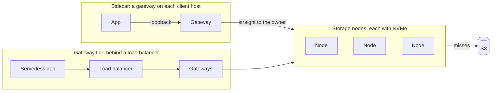
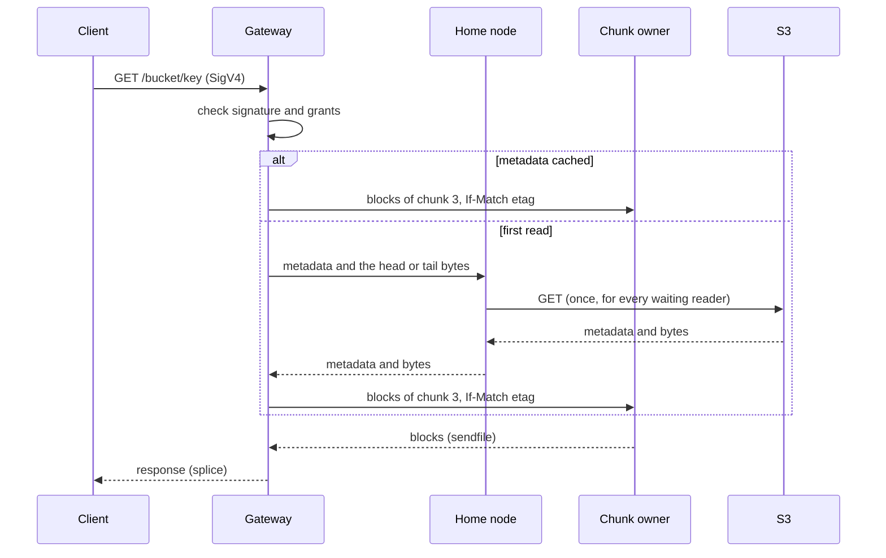
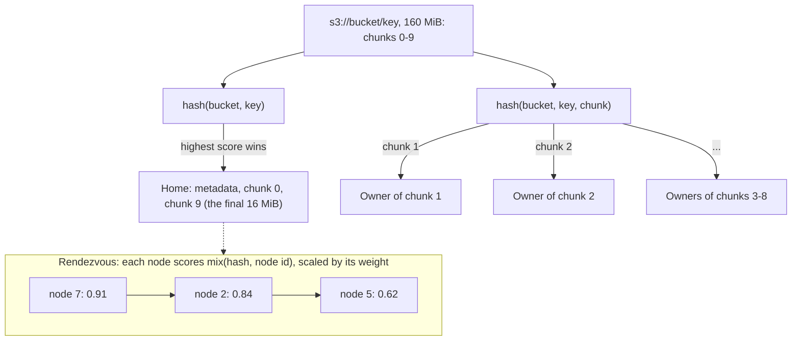
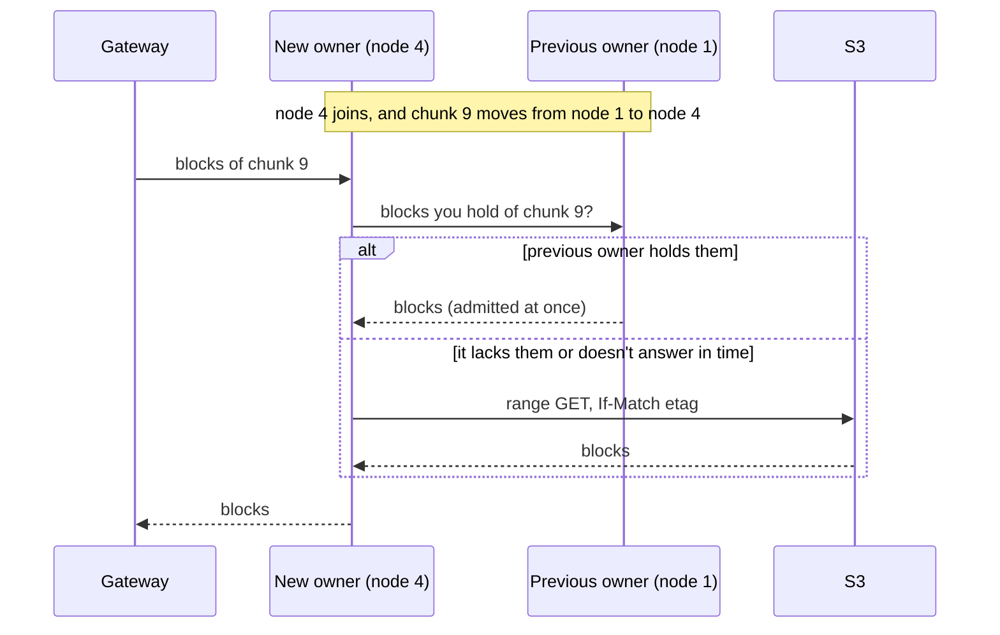
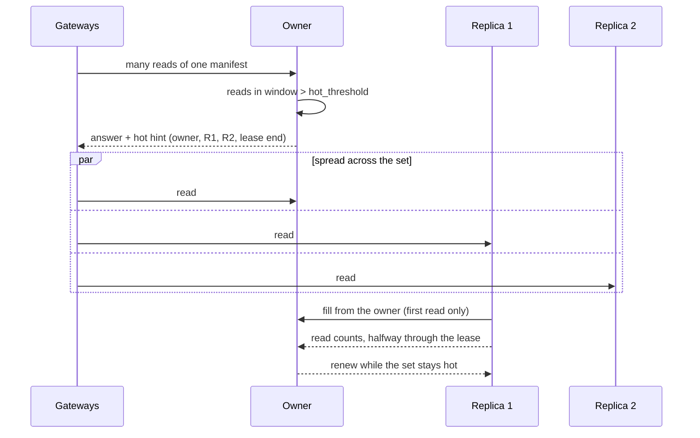
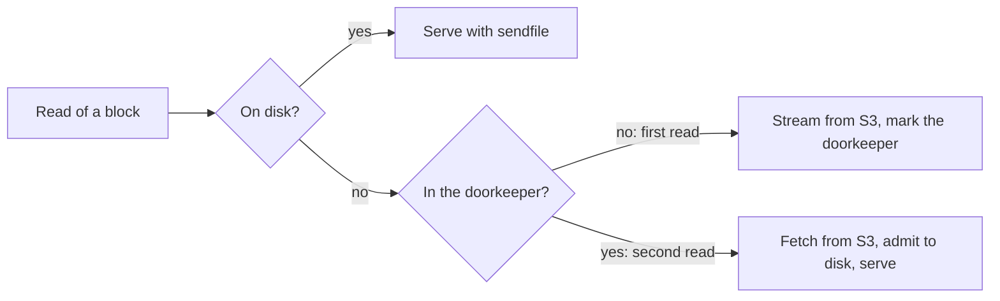

# s3-accelerator

A distributed NVMe read cache in front of S3. Clients keep their S3 SDKs and point them at the cache. S3 stays the source of truth, and the cache holds copies it can always drop. A hit's first byte arrives in under a millisecond, and every hit saves an S3 GET.

[spec.md](spec.md) is the design, [BENCHMARKS.md](BENCHMARKS.md) holds every measurement, and [PLAN.md](PLAN.md) tracks the work.

## Contents

- [Performance](#performance)
- [What sets it apart](#what-sets-it-apart)
- [Quick start](#quick-start)
- [Deployment modes](#deployment-modes)
- [How it works](#how-it-works)
  - [Partitioning](#partitioning)
  - [Ring changes](#ring-changes)
  - [Hot-key replication](#hot-key-replication)
  - [Admission on the second read](#admission-on-the-second-read)
  - [Consistency](#consistency)
- [Operator guide](#operator-guide)
  - [Tuning](#tuning)
- [Development](#development)


*Top: 256 MiB objects. Each storage host sends about 170 Gb/s, and first byte stays near 1.7 ms. Bottom: 4 KiB ranges at 1.84 million reads a second, with first byte under 1 ms. Each line is one storage host, or in the latency panels, one client host.*

## Performance

Ten client hosts (c8in.16xlarge, 100 Gb/s each) read the same data from S3 and through six storage hosts (m8idn.32xlarge, 200 Gb/s each). Each client ran its gateway as a sidecar. Rates are totals across the clients. Latency is time to first byte, p50 / p99.

| Workload | S3 directly | Through the cache | Gain |
|---|---|---|--:|
| Small objects, 1 connection | 218/s, 35 / 120 ms | 13,474/s, 0.64 / 1.1 ms | 62× |
| Small objects, 64 connections | 17,595/s, 25 / 110 ms | 1,392,850/s, 0.38 / 0.66 ms | 79× |
| 4 KiB ranges, 64 connections | 20,694/s, 26 / 98 ms | 1,843,060/s, 0.34 / 0.57 ms | 89× |
| 4 KiB ranges, 1,024 connections | | 6,404,878/s, 1.4 / 4.4 ms | |
| 256 MiB objects, 1 connection | 68 MiB/s a stream, 112 ms | 1.44 GiB/s a stream, 1.25 / 2.2 ms | 22× |
| 256 MiB objects, 64 connections | 54.3 GiB/s, 87 / 176 ms | 115.3 GiB/s, 1.7 / 13 ms | 2.1× |
| 256 MiB objects, 256 connections | 109.5 GiB/s, 34 / 143 ms | 107.8 GiB/s, 1.7 / 22 ms | |

Small objects are 4 to 256 KiB. Connections are per client.

- **Small requests** run 62 to 89 times S3's rate with sub-millisecond latency. At 6.4 million reads a second the client hosts were 81% busy and the storage hosts 17%, so the clients set the limit.
- **Large objects** fill the clients' 1 Tb/s at 16 connections per client. S3 needs 256 connections to come close.
- **TLS** costs small requests 5 to 24% of their rate up to 256 connections, and large reads 1 to 4%.
- **Misses** run at 78 to 100% of S3's own speed.
- **Hosts vary.** Two identical fleets launched the same day differed up to fourfold. See [Tuning](#tuning).

`loadtest/plans/scale.toml` reruns the test.

## What sets it apart

- **Resizing keeps the cache warm.** Adding or removing a node moves only that node's keys. New owners fetch what they took over from the old owners before asking S3. See [Ring changes](#ring-changes).
- **Hot keys replicate themselves.** An overloaded key gets short-lived replicas, and gateways spread its reads across them. See [Hot-key replication](#hot-key-replication).
- **One-time reads stay off disk.** A block reaches NVMe on its second read, so scans don't evict the hot set. See [Admission on the second read](#admission-on-the-second-read).
- **Multi-tenant auth for any S3-compatible origin.** Gateways check SigV4 and per-credential grants on every hit. Each bucket can have its own origin, such as AWS S3, R2 or MinIO.
- **Zero-copy bytes.** Nodes send blocks with `sendfile`, gateways relay them with `splice`, and kernel TLS encrypts inside those calls.

## Quick start

Start an in-memory S3 and one process that runs both a gateway and a storage node:

```console
scripts/s3proxy start                                   # S3 on localhost:8080
cargo run --release -p s3-accelerator -- config/local.toml &
```

Point any S3 client at port 9000:

```console
export AWS_ACCESS_KEY_ID=local-identity AWS_SECRET_ACCESS_KEY=local-credential AWS_REGION=us-east-1
aws --endpoint-url http://127.0.0.1:9000 s3 mb s3://demo
aws --endpoint-url http://127.0.0.1:9000 s3 cp Cargo.toml s3://demo/Cargo.toml
aws --endpoint-url http://127.0.0.1:9000 s3 cp s3://demo/Cargo.toml -   # streams from S3
aws --endpoint-url http://127.0.0.1:9000 s3 cp s3://demo/Cargo.toml -   # stores the blocks
aws --endpoint-url http://127.0.0.1:9000 s3 cp s3://demo/Cargo.toml -   # a hit
curl -s 127.0.0.1:9090/metrics | grep s3accel_node_block_reads_total
```

`scripts/cluster start 3` runs a gateway and three nodes as separate processes. Add `--tls` for TLS everywhere, or `--metadata` for the reference metadata service. `scripts/cluster stop` stops them.

## Deployment modes

One binary runs everything. A `[node]` table makes a process a storage node, a `[gateway]` table makes it a gateway, and a config may have both. Run one cluster per availability zone. Across zones, a hit larger than about 20 KB costs more in transfer than the S3 GET it saves.



| Mode | Use it when | Trade-off |
|---|---|---|
| **Sidecar** | You control the client hosts | Fewest hops. The gateway uses the client's CPU. |
| **Gateway tier** | Clients can't run a sidecar, as on Lambda or Workers | One extra hop. The tier scales on its own. |
| **Gateways on the nodes** | You want the fewest moving parts | One extra hop on the nodes' network cards. |

## How it works

A gateway checks the request's signature, finds the object's metadata, and asks each byte range's owner for it. An owner serves the blocks it holds and fetches the rest from S3, merging concurrent misses into one fetch. Writes and every other operation pass through a storage node to S3.



### Partitioning

Data is stored in 1 MiB **blocks** and placed in 16 MiB **chunks**. Rendezvous hashing of an object's bucket and key picks its **home**. The home keeps the metadata, the first chunk and the last 16 MiB, where Parquet and similar formats keep their footers. Objects up to 32 MiB live entirely on their home. Every other chunk hashes to its own owner, so large reads fan out across the cluster.



Every placement ranks all nodes. The top node owns it, and the next ones take over on failure or serve as replicas when it runs hot. A node's weight, usually its disk size, scales its share.

### Ring changes

Storage nodes find each other by gossip and agree on the ring. Gateways fetch the ring from nodes. When a node joins or leaves, only its keys move. For a short window afterward, a new owner asks the old owner for missing blocks before going to S3.



A node sent `SIGUSR1` leaves the ring, keeps serving its old blocks for the window, then exits. A restarted node keeps its place and its disk, so rolling deploys keep the cache warm.

### Hot-key replication

Each owner counts its reads. When a placement passes `hot_threshold`, the owner leases it to the next `hot_replicas` nodes for a short time. Replicas fill from the owner, and gateways spread reads across the set. The owner renews the lease while the set stays hot. Leases expire on their own.



### Admission on the second read

A block's first read streams from S3 straight to the reader and marks the block in a Bloom filter. A second read soon after stores it. Scans and one-off exports pass through without touching the hot set. Eviction is S3-FIFO, and the page cache keeps the hottest blocks in memory.



Set `admit_on_first_read = true` on a bucket that is nearly always reread, such as a training set.

### Consistency

- Blocks are keyed by ETag, so a response never mixes two versions of an object.
- Every fill after an object's first carries `If-Match`.
- Writes go through the object's home, so a gateway sees its own writes.
- Freshness is set per bucket: `immutable = true` never revalidates, and `ttl_ms` revalidates after that age. S3 event notifications can invalidate entries as objects change.
- 404s are never cached, and versioned reads go straight to S3.

## Operator guide

### Sizing

- **Storage nodes:** local NVMe and the biggest network card available. Large reads make nodes network-bound. In the scale test, each sent about 170 Gb/s at 4% CPU.
- **Node processes:** each runs on one thread, so run several per host for high request rates. The scale test ran 32 on each 128-vCPU host.
- **Gateways:** one event loop per core by default. Give each gateway at least as many client connections as loops.
- **Memory:** the block index takes about 1.6 GB per 4 TB of cache.

### Configuration

A storage node:

```toml
[origin]                       # or [metadata] to look origins up
endpoint = "https://s3.us-east-1.amazonaws.com"
region = "us-east-1"
access_key_id = "AKIA..."
secret_access_key = "..."

[cluster]
secret = "..."                 # shared by every process
nodes = [{ id = 0, address = "10.0.1.10:9400", weight = 3800 },
         { id = 1, address = "10.0.1.11:9400", weight = 3800 }]

[node]
id = 0
data_dir = "/mnt/nvme/s3accel"

[cache.default_policy]
ttl_ms = 5000                  # revalidate metadata after 5 s

[cache.buckets.tables]
immutable = true               # never revalidate

[admin]
listen = "10.0.1.10:9401"      # metrics and health checks
```

A sidecar gateway:

```toml
[[clients]]                    # or [metadata] to look clients up
access_key_id = "analytics"
secret_access_key = "..."
grants = [{ bucket = "tables", access = "read" }, { bucket = "scratch", prefix = "analytics/", access = "write" }]

[cluster]
secret = "..."
nodes = [{ id = 0, address = "10.0.1.10:9400" }]   # any running node

[gateway]
listen = "127.0.0.1:9000"

[admin]
listen = "10.0.2.20:9402"
```

`[gateway.tls]` serves clients over HTTPS. `[cluster.tls]` gives every process a certificate for mutual TLS. Kernel TLS needs Linux 7.0 or later.

### Origins and clients

`[origin]` sets the default origin, and `[origins.<bucket>]` overrides it for one bucket:

```toml
[origins.assets]
endpoint = "https://0123456789abcdef.r2.cloudflarestorage.com"
region = "auto"
access_key_id = "..."
secret_access_key = "..."
```

A metadata service can supply origins and client grants instead. Gateways then hold no client secrets:

```toml
[metadata]
url = "https://metadata.example.com"
token = "..."
```

`s3-accelerator-metadata CONFIG` runs a reference service that reads a TOML file and reloads it on `SIGHUP`.

### Freshness and events

Send a bucket's event notifications to SQS and name the queue on each node:

```toml
[events]
queue_url = "https://sqs.us-east-1.amazonaws.com/123456789012/bucket-events"
visibility_timeout_s = 30
```

Events keep metadata fresh. Set a long `ttl_ms`, such as an hour, to cover a missed event.

### Changing the cluster

- **Grow:** start a node that names any running node. It joins by gossip.
- **Shrink:** send the node `SIGUSR1`. It hands off its blocks, then exits.
- **Restart:** send `SIGTERM`. A node back within the down grace period keeps its place and its disk.
- **Purge:** `POST /bucket/key?x-accel-purge` erases an object from every node.

### Monitoring

Each connection holds a file descriptor, so raise the hard limit: `LimitNOFILE=1048576` in systemd, or `--ulimit nofile=1048576` in Docker.

The admin listener serves `/metrics`, `/healthz` and `/readyz`. Keep it on a private address.

| Metric | Shows |
|---|---|
| `s3accel_gateway_requests_total`, `s3accel_gateway_first_byte_seconds` | Requests and time to first byte |
| `s3accel_node_block_reads_total{result}` | Hit rate: blocks served (`hit`) against filled (`fetched`) |
| `s3accel_node_body_bytes_total{source}` | Bytes from the cache, S3 and previous owners |
| `s3accel_node_admissions_total{result}` | Blocks stored, and why others weren't |
| `s3accel_ring_nodes` | Membership as each process sees it |
| `process_open_fds`, `process_max_fds` | Descriptor use against the limit |

### Tuning

**TCP timers.** A full network card drops packets, and Linux waits 200 ms before resending one. The cluster shortens that to 5 ms on its own links:

```toml
[cluster.tcp]
rto_min_us = 5000      # resend after 5 ms
delack_max_us = 5000   # acknowledge within 5 ms
```

256 MiB reads with the clients' network cards full:

| Timers | 64 connections | 256 connections |
|---|---|---|
| 5 ms (default) | 115.2 GiB/s, p99.9 19 ms | 106.0 GiB/s, p99 24 ms |
| Linux's (`0`) | 115.2 GiB/s, p99.9 213 ms | 112.6 GiB/s, p99 209 ms |
| 20 ms | 115.3 GiB/s, p99.9 31 ms | 109.2 GiB/s, p99.9 1,044 ms |

Keep the default when latency matters. Set `0` for batch jobs that want the last 6% of throughput and can tolerate 200 ms stalls. Avoid values in between. The timers need Linux 6.15 or later, and `ss -ti` shows each link's current `rto`.

**Equal weights.** Give every node the same weight when you can. Nodes then rank keys by hash alone, which saved a tenth of each storage host's CPU in the scale test.

**Hosts vary.** Load-test a new fleet before trusting it. In our tests, one fleet ran at a quarter of another identical fleet's speed. Compare hosts with each other and replace outliers. The load test's report shows each host's CPU, network, retransmissions and dropped packets. `ethtool -S` shows a network card's `allowance_exceeded` counters.

**Gateway CPU.** A sidecar gateway shares its host with the application. At 6 million reads a second, the client hosts were 80% busy.

## Development

- `crates/core`: gateway and storage logic as deterministic state machines with no I/O.
- `crates/server`: the `s3-accelerator` binary, which runs the core over sockets and disks.
- `crates/sim`: a deterministic simulator of gateways, nodes, clients and S3.
- `crates/load`: a load generator for clusters and for S3.
- `crates/bench`: single-machine benchmarks.
- `loadtest`: the EC2 load test: Terraform, plans and a driver.
- `tests`: the S3 conformance suite.

### Testing

```console
cargo test --workspace                        # unit, server and simulator tests
scripts/s3proxy start                         # in-memory S3 on localhost:8080
sudo modprobe tls                             # kernel TLS
cargo test --workspace -- --include-ignored   # adds conformance and kernel TLS tests
scripts/s3proxy stop
```

Server tests need Linux and `strace`. They check zero-copy and kernel TLS from outside the process, with `strace`, `ss` and `/proc/net/tls_stat`. Kernel TLS needs Linux 7.0 or later.

Run the conformance suite through the accelerator:

```console
cargo run -p s3-accelerator -- config/local.toml &
CONFORMANCE_ENDPOINT=http://127.0.0.1:9000 cargo test -p s3-accelerator-conformance -- --ignored
```

### Simulator

A seed fixes the whole run: cluster size, workload and every delay. Writers change objects while clients read, and every response must match what S3 could have returned. Pass a run's seed back to replay it exactly.

```console
cargo run --release -p s3-accelerator-sim                      # a random seed
cargo run --release -p s3-accelerator-sim -- 42                # replay seed 42
cargo run --release -p s3-accelerator-sim -- 0 --seeds 10000   # seeds 0 to 9,999 on every core
```

`scripts/mutants` plants known bugs one at a time and reports which tests catch each.

### Benchmarks and load tests

`crates/bench` measures one machine. `loadtest/README.md` runs a cluster on EC2 against real S3. [BENCHMARKS.md](BENCHMARKS.md) records every run.
